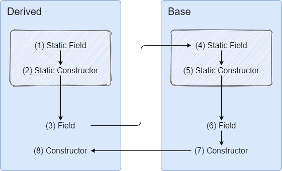

# Object initialization in C#

## Rules

- **Fields then constructor** - Fields are initialized first, then the constructor is executed.
- **Static then instance** - Static fields and constructors are initialized the first time a class is accessed.  Then the object’s instance fields and constructors are  initialized.
- **Instance fields: derived then base** - For instance fields, derived objects are initialized before the base object.

- **Instance constructor: base then derived** - For instance constructors, the base class constructor executes before the derived class constructor.

## Order

(1) Derived.Static.Field
(2) Derived.Static.Constructor
(3) Derived.Instance.Field

(4) Base.Static.Field
(5) Base.Static.Constructor
(6) Base.Instance.Field
(7) Base.Instance.Constructor

(8) Derived.Instance.Constructor

