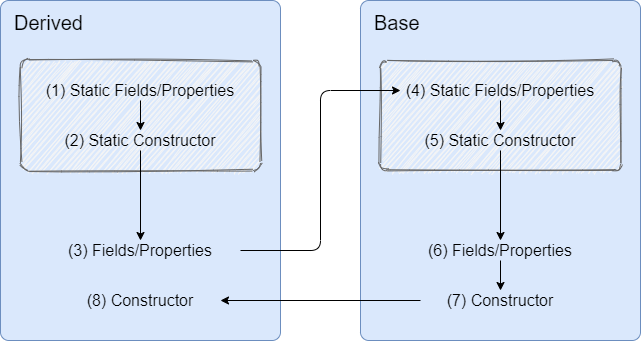

# Object initialization in C#

## Problem Description

Sometimes (not very often), the order in which the fields, properties and constructors are initialized/called is important. In this C# Pill I will try to answer this question:

- What is the order in which are initialized/called fields, properties and constructors, both static and instance in C#?

## Setup

To answer the above question, I created a small Console Application project containing two classes:

- `Base` class
- `Derived` class

### Fields and Properties

In each class I added and initialized at declaration:

- a static field;
- a static property;
- an instance field;
- an instance property;

Fields and properties in `Base` class:

```csharp
private static Trace staticField = new Trace("Base.Static.Field");
private Trace instanceField = new Trace("Base.Instance.Field");

private static Trace StaticProperty { get; set; } = new Trace("Base.Static.Property");
private Trace InstanceProperty { get; set; } = new Trace("Base.Instance.Property");
```

Fields and properties in `Derived` class:

```csharp
private static Trace staticField = new Trace("Derived.Static.Field");
private Trace instanceField = new Trace("Derived.Instance.Field");

private static Trace StaticProperty { get; set; } = new Trace("Derived.Static.Property");
private Trace InstanceProperty { get; set; } = new Trace("Derived.Instance.Property");
```

### The `Trace` class

These fields and properties that I created are of a custom type that I called `Trace` that will write at the console the provided message when a new instance of it is created. In this way we will see the order in which each field/property is initialized because, when initialized, a new instance of `Trace` is created.

The `Trace` class:

```csharp
internal class Trace
{
	public Trace(string text)
	{
		Console.WriteLine(text);
	}
}
```

### Constructors

In each class I created a static constructor and an instance constructor.

Constructor in the `Base` class:

```csharp
static Base()
{
    Console.WriteLine("Base.Static.Constructor");
}

public Base()
{
    Console.WriteLine("Base.Instance.Constructor");
}
```

Constructor in the `Derived` class:

```csharp
static Derived()
{
    Console.WriteLine("Derived.Static.Constructor");
}

public Derived()
{
    Console.WriteLine("Derived.Instance.Constructor");
}
```

## Test

The final code looks like this:

```csharp
internal class Base
{
    private static Trace staticField = new Trace("Base.Static.Field");
    private Trace instanceField = new Trace("Base.Instance.Field");

    private static Trace StaticProperty { get; set; } = new Trace("Base.Static.Property");
    private Trace InstanceProperty { get; set; } = new Trace("Base.Instance.Property");

    static Base()
    {
        Console.WriteLine("Base.Static.Constructor");
    }

    public Base()
    {
        Console.WriteLine("Base.Instance.Constructor");
    }
}

internal class Derived : Base
{
    private static Trace staticField = new Trace("Derived.Static.Field");
    private Trace instanceField = new Trace("Derived.Instance.Field");

    private static Trace StaticProperty { get; set; } = new Trace("Derived.Static.Property");
    private Trace InstanceProperty { get; set; } = new Trace("Derived.Instance.Property");

    static Derived()
    {
        Console.WriteLine("Derived.Static.Constructor");
    }

    public Derived()
    {
        Console.WriteLine("Derived.Instance.Constructor");
    }
}

internal class Trace
{
    public Trace(string text)
    {
        Console.WriteLine(text);
    }
}
```

### Results

When running the application, we obtain the following result:

```
Derived.Static.Field
Derived.Static.Property
Derived.Static.Constructor
Derived.Instance.Field
Derived.Instance.Property
Base.Static.Field
Base.Static.Property
Base.Static.Constructor
Base.Instance.Field
Base.Instance.Property
Base.Instance.Constructor
Derived.Instance.Constructor
```

> **Note**
>
> The fields and properties are initialized in the order in which they are declared.
>
> The compiler does not make a significant difference between fields and properties at the initialization time. This is expected, because a property is in fact a private field and a couple of methods. The field is the one that gets initialized.

## Rules

From this small experiment we can deduce a set of rules for the initialization process in C#:

- **Fields and properties then constructor** - Fields are initialized first, then the constructor is executed.
- **Static then instance** - Static fields and constructors are initialized the first time a class is accessed.  Then the object’s instance fields and constructors are  initialized.
- **Instance fields and properties: derived then base** - For instance fields, derived objects are initialized before the base object.

- **Instance constructor: base then derived** - For instance constructors, the base class constructor executes before the derived class constructor.

## Conclusion

The order of initializing fields, properties and calling constructors is the following:




